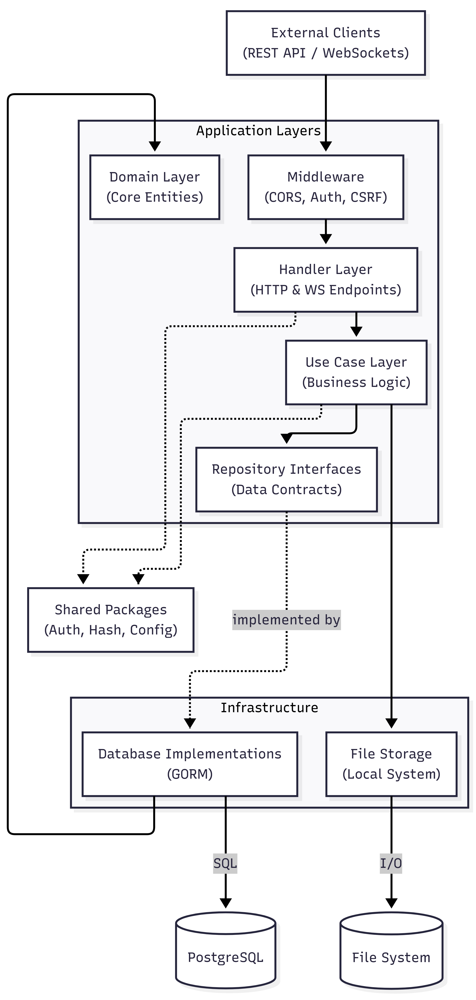
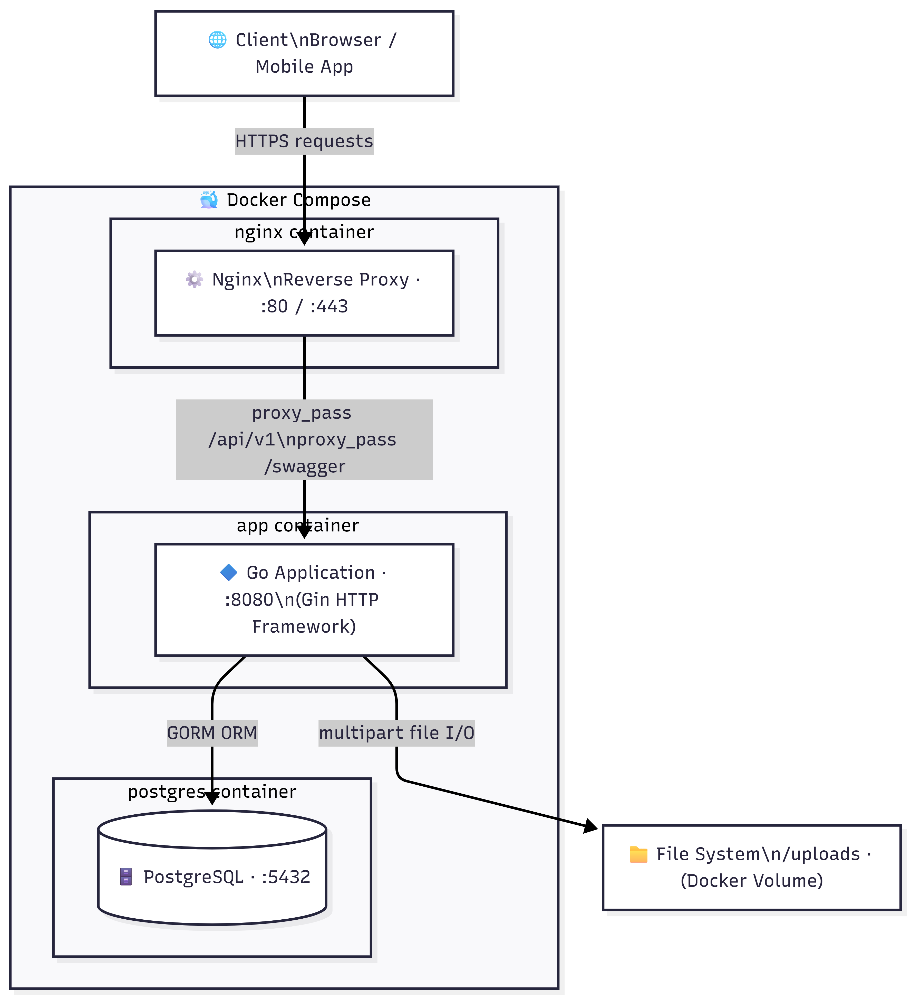

<div align="center">

# 🌐 SocialConnect Backend

**A high-performance social networking API built with Go, PostgreSQL, and WebSockets**

[](https://github.com/CackSocial/cack-backend/actions/workflows/ci.yml)
[](https://go.dev/)
[](https://github.com/gin-gonic/gin)
[](https://www.postgresql.org/)
[](https://gorm.io/)
[](https://www.docker.com/)
[](https://nginx.org/)
[](https://swagger.io/)
[](https://jwt.io/)
[](LICENSE)

Posts · Follows · Timeline · Direct Messaging · Likes · Comments · Bookmarks · Notifications · Trending Tags · Explore

</div>

---

## Table of Contents

- [Features](#features)
- [Tech Stack](#tech-stack)
- [Architecture](#architecture)
  - [Directory Structure](#directory-structure)
  - [Clean Architecture Layers](#clean-architecture-layers)
  - [Request Lifecycle](#request-lifecycle)
  - [Dependency Injection Wiring](#dependency-injection-wiring)
- [Getting Started](#getting-started)
  - [Prerequisites](#prerequisites)
  - [Docker (Recommended)](#docker-recommended)
  - [Local Development](#local-development)
- [Configuration](#configuration)
- [API Reference](#api-reference)
  - [Authentication](#authentication)
  - [Users](#users)
  - [Posts](#posts)
  - [Timeline](#timeline)
  - [Follow System](#follow-system)
  - [Likes](#likes)
  - [Comments](#comments)
  - [Bookmarks](#bookmarks)
  - [Tags](#tags)
  - [Direct Messaging](#direct-messaging)
  - [Notifications](#notifications)
  - [Explore / Discover](#explore--discover)
  - [WebSocket](#websocket)
- [Database Schema](#database-schema)
- [File Uploads](#file-uploads)
- [Error Handling](#error-handling)
- [Middleware](#middleware)
- [Testing](#testing)
- [CI/CD](#cicd)
- [Deployment](#deployment)
  - [Docker Compose (Production)](#docker-compose-production)
  - [Nginx Reverse Proxy](#nginx-reverse-proxy)
- [Available Make Commands](#available-make-commands)
- [Troubleshooting](#troubleshooting)

---

## Features

| Feature | Description |
|---------|-------------|
| **Posts** | Text, image, or text+image posts with automatic hashtag extraction |
| **Reposts & Quotes** | Repost or quote-post another user's content |
| **Timeline** | Chronological feed from followed users + own posts |
| **Follow System** | Follow/unfollow with follower and following lists |
| **Likes** | Like/unlike posts, view liked posts per user |
| **Comments** | Nested comments on posts with `@mention` notifications |
| **Bookmarks** | Save posts for later |
| **Tags** | Hashtag extraction from post content, trending tags (last 24h) |
| **Direct Messaging** | Real-time DMs via WebSocket with text and image support |
| **Notifications** | Real-time push notifications for likes, follows, comments, mentions, reposts |
| **Explore** | Suggested users (mutual followers), popular posts, discover feed by liked tags |
| **Auth** | JWT-based authentication with CSRF protection and HttpOnly cookies |
| **File Uploads** | Image uploads for posts, messages, and avatars (JPEG, PNG, GIF, WebP) |
| **Swagger** | Auto-generated OpenAPI docs at `/swagger/index.html` |

---

## Tech Stack

| Component | Technology |
|-----------|------------|
| **Language** | Go 1.26 |
| **HTTP Framework** | [Gin](https://github.com/gin-gonic/gin) v1.10 |
| **Database** | PostgreSQL 16 via [GORM](https://gorm.io/) v1.31 |
| **Real-time** | [Gorilla WebSocket](https://github.com/gorilla/websocket) v1.5 |
| **Auth** | JWT HS256 ([golang-jwt](https://github.com/golang-jwt/jwt)) + bcrypt |
| **API Docs** | [Swaggo](https://github.com/swaggo/swag) (Swagger/OpenAPI) |
| **Containerization** | Docker + Docker Compose |
| **Reverse Proxy** | Nginx (rate limiting, gzip, static assets, WebSocket upgrade) |
| **CI/CD** | GitHub Actions (lint → test → build) |

---

## Architecture

This project follows **Clean Architecture** with strict layer boundaries. Dependencies always point inward—handlers depend on use cases, use cases depend on repository interfaces, and implementations depend on infrastructure.



**Request Flow**


### Directory Structure

```
cack-backend/
├── cmd/
│   └── server/
│       └── main.go                         # Entry point, DI wiring, router setup
├── internal/
│   ├── domain/                             # GORM domain models
│   │   ├── user.go                         #   User (UUID PK, username, password, bio, avatar)
│   │   ├── post.go                         #   Post (text/image, post_type, original_post for reposts)
│   │   ├── comment.go                      #   Comment (post_id, user_id, content)
│   │   ├── follow.go                       #   Follow (composite PK: follower_id + following_id)
│   │   ├── like.go                         #   Like (composite PK: user_id + post_id)
│   │   ├── message.go                      #   Message (sender, receiver, content, image, read_at)
│   │   ├── bookmark.go                     #   Bookmark (composite PK: user_id + post_id)
│   │   ├── tag.go                          #   Tag (auto-increment PK, unique name)
│   │   ├── post_tag.go                     #   PostTag join table
│   │   └── notification.go                 #   Notification (like/follow/comment/mention/repost)
│   ├── repository/                         # Repository interfaces
│   │   ├── user.go                         #   UserRepository (CRUD + Search + Suggestions)
│   │   ├── post.go                         #   PostRepository (CRUD + Feed + Tags + Discover)
│   │   ├── follow.go                       #   FollowRepository (follow/unfollow + lists)
│   │   ├── like.go                         #   LikeRepository (like/unlike + counts + liked tags)
│   │   ├── comment.go                      #   CommentRepository (CRUD + counts)
│   │   ├── message.go                      #   MessageRepository (send + conversations + mark-read)
│   │   ├── bookmark.go                     #   BookmarkRepository (CRUD + check)
│   │   ├── tag.go                          #   TagRepository (find-or-create + trending)
│   │   └── notification.go                 #   NotificationRepository (CRUD + unread count)
│   ├── usecase/                            # Business logic
│   │   ├── errors/errors.go                #   Shared domain error definitions
│   │   ├── user/usecase.go                 #   Register, Login, Profile, Update, Delete
│   │   ├── post/usecase.go                 #   Create, Get, Delete, Repost, Quote
│   │   ├── follow/usecase.go               #   Follow, Unfollow, Followers, Following
│   │   ├── like/usecase.go                 #   Like, Unlike, Post likes, User liked posts
│   │   ├── comment/usecase.go              #   Create (with @mention notifs), List, Delete
│   │   ├── message/usecase.go              #   Send, GetConversation, GetConversations
│   │   ├── bookmark/usecase.go             #   Bookmark, Unbookmark, List
│   │   ├── tag/usecase.go                  #   Trending, Posts by tag
│   │   ├── timeline/usecase.go             #   Chronological feed from followed + own
│   │   ├── notification/usecase.go         #   Create, List, MarkRead, UnreadCount
│   │   └── explore/usecase.go              #   Suggested users, Popular posts, Discover
│   ├── dto/                                # Request/Response data transfer objects
│   │   ├── user.go                         #   Register/Login/Profile/Update DTOs
│   │   ├── post.go                         #   CreatePost/PostResponse DTOs
│   │   ├── comment.go                      #   CreateComment/CommentResponse DTOs
│   │   ├── message.go                      #   SendMessage/MessageResponse/WSMessage DTOs
│   │   ├── notification.go                 #   NotificationResponse/UnreadCount DTOs
│   │   ├── explore.go                      #   SuggestedUserResponse DTO
│   │   └── common.go                       #   PaginationQuery DTO
│   ├── handler/                            # HTTP handlers (Gin)
│   │   ├── user.go                         #   Auth + profile endpoints
│   │   ├── post.go                         #   Post CRUD + repost/quote
│   │   ├── follow.go                       #   Follow/unfollow + lists
│   │   ├── like.go                         #   Like/unlike + lists
│   │   ├── comment.go                      #   Comment CRUD
│   │   ├── message.go                      #   DM endpoints
│   │   ├── bookmark.go                     #   Bookmark endpoints
│   │   ├── tag.go                          #   Trending + posts by tag
│   │   ├── timeline.go                     #   Timeline feed
│   │   ├── notification.go                 #   Notification endpoints
│   │   ├── explore.go                      #   Explore/discover endpoints
│   │   ├── helpers.go                      #   getUserID, getPagination, handleError
│   │   └── ws/                             #   WebSocket real-time messaging
│   │       ├── hub.go                      #     Connection hub + SendToUser
│   │       └── handler.go                  #     WS upgrade handler
│   ├── middleware/                          # HTTP middleware
│   │   ├── auth.go                         #   AuthMiddleware + OptionalAuth
│   │   ├── cors.go                         #   CORS configuration
│   │   └── csrf.go                         #   CSRF token protection
│   └── infrastructure/
│       ├── database/
│       │   ├── postgres.go                 #   DB connection + auto-migration
│       │   └── repository/                 #   GORM implementations of all repo interfaces
│       └── storage/
│           ├── storage.go                  #   Storage interface (Upload/Delete)
│           └── local.go                    #   Local filesystem implementation
├── pkg/                                    # Shared utility packages
│   ├── config/config.go                    #   Environment variable loading
│   ├── auth/jwt.go                         #   JWT generate/validate/extract
│   ├── hash/password.go                    #   bcrypt hash/check
│   ├── mentions/mentions.go                #   @mention extraction from text
│   └── response/response.go               #   Standardized API response helpers
├── docs/                                   # Generated API documentation
│   ├── swagger.json                        #   OpenAPI spec (JSON)
│   ├── swagger.yaml                        #   OpenAPI spec (YAML)
│   ├── docs.go                             #   Swagger Go registration
│   └── SocialConnect.postman_collection.json
├── nginx/
│   └── nginx.conf                          #   Reverse proxy config
├── .github/workflows/
│   └── ci.yml                              #   Lint → Test → Build pipeline
├── Dockerfile                              #   Multi-stage build (golang:1.26 → alpine:3.19)
├── docker-compose.yml                      #   App + PostgreSQL + Nginx
├── Makefile                                #   Build automation
├── .env.example                            #   Environment variable template
├── go.mod / go.sum                         #   Go module definition
└── uploads/                                #   User-uploaded files (gitignored)
```

### Clean Architecture Layers

| Layer | Location | Responsibility |
|-------|----------|----------------|
| **Domain** | `internal/domain/` | GORM models with zero external dependencies. Define data shape and DB schema. |
| **Repository Interfaces** | `internal/repository/` | Abstract contracts for data access. Use cases depend on these, not on GORM. |
| **Repository Implementations** | `internal/infrastructure/database/repository/` | Concrete GORM-based data access. Only place where SQL/GORM calls exist. |
| **Use Cases** | `internal/usecase/{feature}/usecase.go` | All business logic. Orchestrates repos, storage, notifications. Never touches HTTP. |
| **DTOs** | `internal/dto/` | Request/response shapes. Decouples API contract from domain models. |
| **Handlers** | `internal/handler/` | Thin HTTP layer. Validates input → calls use case → returns response. |
| **Middleware** | `internal/middleware/` | Cross-cutting: auth, CORS, CSRF. |
| **Shared Packages** | `pkg/` | Reusable utilities: config, JWT, bcrypt, response formatting, mentions. |

### Dependency Injection Wiring

All dependencies are wired in `cmd/server/main.go` following this order:

```
Config → PostgreSQL → Repositories → Storage → WebSocket Hub
  → Use Cases (notification first, then others that depend on it)
    → Handlers → Gin Router → Start Server
```

---

## Getting Started

### Prerequisites

- **Go 1.26+** — [Install Go](https://go.dev/dl/)
- **PostgreSQL 16+** — or Docker to run it in a container
- **Make** — for build automation (optional but recommended)
- **Docker & Docker Compose** — for containerized deployment

### Docker (Recommended)

The fastest way to get everything running. This starts the Go API, PostgreSQL, and Nginx reverse proxy:

```bash
# 1. Clone the repository
git clone https://github.com/CackSocial/cack-backend.git
cd cack-backend

# 2. Create your environment file
cp .env.example .env
# Edit .env — at minimum change JWT_SECRET for production

# 3. Start all services
docker compose up -d --build
```

This starts three containers:

| Service | Port | Description |
|---------|------|-------------|
| **app** | 8080 | Go API server |
| **postgres** | 5432 | PostgreSQL 16 database |
| **nginx** | 80 | Reverse proxy with rate limiting, gzip, and static file serving |

The API is now available at `http://localhost` (port 80 via Nginx) or `http://localhost:8080` (direct).

```bash
# View logs
docker compose logs -f

# Stop all services
docker compose down

# Stop and remove volumes (including database data)
docker compose down -v
```

### Local Development

If you prefer running without Docker, you'll need a local PostgreSQL instance:

```bash
# 1. Clone the repository
git clone https://github.com/CackSocial/cack-backend.git
cd cack-backend

# 2. Start PostgreSQL (example using Docker for just the database)
docker run -d --name postgres \
  -e POSTGRES_USER=postgres \
  -e POSTGRES_PASSWORD=postgres \
  -e POSTGRES_DB=socialconnect \
  -p 5432:5432 \
  postgres:16-alpine

# 3. Create and configure environment file
cp .env.example .env
# Edit .env with your database credentials if different from defaults

# 4. Install Go dependencies
go mod download

# 5. Start the server
make run
# Or without Make:
# go run ./cmd/server
```

The server starts on `http://localhost:8080`. GORM auto-migrates all tables on startup—no manual SQL required.

Open `http://localhost:8080/swagger/index.html` for the interactive Swagger UI.

---

## Configuration

All configuration is loaded from environment variables (with `.env` file support via godotenv).

| Variable | Description | Default |
|----------|-------------|---------|
| `SERVER_PORT` | HTTP server port | `8080` |
| `DB_HOST` | PostgreSQL host | `localhost` |
| `DB_PORT` | PostgreSQL port | `5432` |
| `DB_USER` | PostgreSQL username | `postgres` |
| `DB_PASSWORD` | PostgreSQL password | `postgres` |
| `DB_NAME` | PostgreSQL database name | `socialconnect` |
| `DB_SSLMODE` | PostgreSQL SSL mode | `disable` |
| `JWT_SECRET` | Secret key for signing JWT tokens | `your-secret-key-change-in-production` |
| `JWT_EXPIRY_HOURS` | JWT token lifetime in hours | `72` |
| `UPLOAD_PATH` | Directory for uploaded files | `./uploads` |
| `MAX_UPLOAD_SIZE_MB` | Maximum file upload size in MB | `10` |
| `BASE_URL` | Base URL for constructing file URLs | `http://localhost:8080` |
| `CORS_ORIGIN` | Allowed CORS origin | `http://localhost:5173` |

> ⚠️ **Always change `JWT_SECRET` in production.** Use a cryptographically random string of at least 32 characters.

---

## API Reference

All REST endpoints are prefixed with `/api/v1`. Full interactive documentation is available at `/swagger/index.html` when the server is running, and a Postman collection is included at `docs/SocialConnect.postman_collection.json`.

### Response Format

All endpoints return a consistent JSON envelope:

```json
// Success
{ "success": true, "data": { ... } }

// Success with pagination
{ "success": true, "data": [...], "page": 1, "limit": 20, "total": 42 }

// Error
{ "success": false, "message": "error description" }
```

### Authentication

JWT tokens are delivered in the `sc-token` HttpOnly cookie on login/register. For API clients, tokens are also accepted via the `Authorization: Bearer <token>` header.

Protected endpoints require the `X-CSRF-Token` header (value from the `sc-csrf` cookie) for state-changing methods (POST, PUT, DELETE, PATCH).

| Method | Endpoint | Auth | Description |
|--------|----------|------|-------------|
| `POST` | `/auth/register` | — | Create a new account |
| `POST` | `/auth/login` | — | Authenticate and receive JWT |
| `POST` | `/auth/logout` | — | Clear auth cookies |

**Register request:**
```json
{
  "username": "johndoe",
  "password": "securepass123",
  "display_name": "John Doe"
}
```

**Login response:**
```json
{
  "success": true,
  "data": {
    "token": "eyJhbGciOiJIUzI1NiIs...",
    "user": {
      "id": "550e8400-e29b-41d4-a716-446655440000",
      "username": "johndoe",
      "display_name": "John Doe",
      "bio": "",
      "avatar_url": "",
      "follower_count": 0,
      "following_count": 0,
      "is_following": false
    }
  }
}
```

### Users

| Method | Endpoint | Auth | Description |
|--------|----------|------|-------------|
| `GET` | `/users/:username` | Optional | Get user profile (includes `is_following` when authenticated) |
| `PUT` | `/users/me` | Required | Update display name, bio, or avatar (multipart/form-data) |
| `DELETE` | `/users/me` | Required | Delete account (requires password confirmation) |

### Posts

| Method | Endpoint | Auth | Description |
|--------|----------|------|-------------|
| `POST` | `/posts` | Required | Create a post (multipart/form-data: `content` + optional `image`) |
| `GET` | `/posts/:id` | Optional | Get a single post with engagement metrics |
| `DELETE` | `/posts/:id` | Required | Delete own post |
| `GET` | `/users/:username/posts` | Optional | Get a user's posts (paginated) |
| `POST` | `/posts/:id/repost` | Required | Repost another user's post |
| `DELETE` | `/posts/:id/repost` | Required | Remove your repost |
| `POST` | `/posts/:id/quote` | Required | Quote-post with your own content |

**Post response includes:** `like_count`, `comment_count`, `repost_count`, `is_liked`, `is_bookmarked`, `is_reposted`, `tags[]`, and nested `original_post` for reposts/quotes.

### Timeline

| Method | Endpoint | Auth | Description |
|--------|----------|------|-------------|
| `GET` | `/timeline?page=1&limit=20` | Required | Chronological feed from followed users + own posts |

### Follow System

| Method | Endpoint | Auth | Description |
|--------|----------|------|-------------|
| `POST` | `/users/:username/follow` | Required | Follow a user |
| `DELETE` | `/users/:username/follow` | Required | Unfollow a user |
| `GET` | `/users/:username/followers` | — | List a user's followers (paginated) |
| `GET` | `/users/:username/following` | — | List who a user follows (paginated) |

### Likes

| Method | Endpoint | Auth | Description |
|--------|----------|------|-------------|
| `POST` | `/posts/:id/like` | Required | Like a post |
| `DELETE` | `/posts/:id/like` | Required | Unlike a post |
| `GET` | `/posts/:id/likes` | — | List users who liked a post (paginated) |
| `GET` | `/users/:username/likes` | Optional | List posts a user has liked (paginated) |

### Comments

| Method | Endpoint | Auth | Description |
|--------|----------|------|-------------|
| `POST` | `/posts/:id/comments` | Required | Add a comment (supports `@mentions` → sends notifications) |
| `GET` | `/posts/:id/comments` | — | List comments on a post (paginated) |
| `DELETE` | `/comments/:id` | Required | Delete own comment |

### Bookmarks

| Method | Endpoint | Auth | Description |
|--------|----------|------|-------------|
| `POST` | `/posts/:id/bookmark` | Required | Bookmark a post |
| `DELETE` | `/posts/:id/bookmark` | Required | Remove bookmark |
| `GET` | `/bookmarks` | Required | List bookmarked posts (paginated) |

### Tags

| Method | Endpoint | Auth | Description |
|--------|----------|------|-------------|
| `GET` | `/tags/trending` | — | Get trending hashtags (last 24 hours) |
| `GET` | `/tags/:name/posts` | Optional | Get posts with a specific tag (paginated) |

Hashtags are automatically extracted from post content (e.g., `#golang` → tag `golang`). Tags are created on first use via find-or-create.

### Direct Messaging

| Method | Endpoint | Auth | Description |
|--------|----------|------|-------------|
| `GET` | `/messages/conversations` | Required | List all conversations (paginated, with last message + unread count) |
| `GET` | `/messages/:username` | Required | Get conversation with a user (paginated, auto marks as read) |
| `POST` | `/messages/:username` | Required | Send a message (multipart/form-data: `content` + optional `image`) |

### Notifications

| Method | Endpoint | Auth | Description |
|--------|----------|------|-------------|
| `GET` | `/notifications` | Required | List notifications (paginated) |
| `PUT` | `/notifications/:id/read` | Required | Mark a single notification as read |
| `PUT` | `/notifications/read-all` | Required | Mark all notifications as read |
| `GET` | `/notifications/unread-count` | Required | Get unread notification count |

**Notification types:** `like`, `follow`, `comment`, `mention`, `repost`

Notifications are pushed in real-time via WebSocket when the recipient is online.

### Explore / Discover

| Method | Endpoint | Auth | Description |
|--------|----------|------|-------------|
| `GET` | `/explore/suggested-users` | Required | Users you might know (by mutual followers) |
| `GET` | `/explore/popular` | Required | High-engagement posts from the last 7 days |
| `GET` | `/explore/discover` | Required | Posts matching tags you've liked |

### WebSocket

**Endpoint:** `GET /api/v1/ws?token=<jwt>`

Authenticates via the JWT query parameter. Once connected, the hub manages bidirectional messaging.

```
Client → Server: { "type": "message", "receiver_id": "<uuid>", "content": "Hello!" }
Server → Client: { "type": "new_message", ... }  // pushed when someone messages you
Server → Client: { "type": "notification", ... }  // pushed for likes, follows, comments, etc.
```

The WebSocket hub tracks connected clients by user ID. Messages and notifications are pushed via `SendToUser()` if the recipient is online.

---

## Database Schema

PostgreSQL with GORM auto-migration. All tables are created/updated on server startup—no manual migration files needed.

```
┌──────────┐     ┌──────────┐     ┌──────────┐
│  users   │────<│  posts   │────<│ comments │
│  (UUID)  │     │  (UUID)  │     │  (UUID)  │
└──────────┘     └──────────┘     └──────────┘
     │                │ │
     │    ┌───────────┘ └──────────┐
     │    │                        │
┌────┴────┴┐  ┌──────────┐  ┌─────┴────┐
│  follows  │  │  likes   │  │post_tags │
│(composite)│  │(composite)│  │  (join)  │
└───────────┘  └──────────┘  └─────┬────┘
                                   │
┌──────────┐   ┌──────────┐  ┌────┴─────┐
│ messages │   │bookmarks │  │   tags   │
│  (UUID)  │   │(composite)│  │  (auto)  │
└──────────┘   └──────────┘  └──────────┘

┌───────────────┐
│ notifications │
│    (UUID)     │
└───────────────┘
```

| Table | Primary Key | Description |
|-------|-------------|-------------|
| `users` | UUID (auto-generated) | User accounts with username, hashed password, bio, avatar |
| `posts` | UUID | Posts with optional image, post_type (original/repost/quote), original_post reference |
| `comments` | UUID | Comments on posts, linked to user and post |
| `follows` | Composite (follower_id + following_id) | Follow relationships between users |
| `likes` | Composite (user_id + post_id) | Post likes |
| `messages` | UUID | Direct messages with sender, receiver, optional image, read_at timestamp |
| `bookmarks` | Composite (user_id + post_id) | Saved posts |
| `tags` | Auto-increment integer | Unique tag names |
| `post_tags` | Composite (post_id + tag_id) | Many-to-many join for posts ↔ tags |
| `notifications` | UUID | Activity notifications with type, actor, reference |

---

## File Uploads

Files are stored on the local filesystem with a UUID-based naming scheme to prevent collisions.

| Property | Value |
|----------|-------|
| **Max file size** | 10 MB (configurable via `MAX_UPLOAD_SIZE_MB`) |
| **Allowed types** | `image/jpeg`, `image/png`, `image/gif`, `image/webp` |
| **Storage path** | `./uploads/` (configurable via `UPLOAD_PATH`) |
| **URL format** | `{BASE_URL}/uploads/{uuid}.{ext}` |
| **Naming** | `{random-uuid}.{original-extension}` |

The storage layer is abstracted behind the `Storage` interface (`internal/infrastructure/storage/storage.go`), making it straightforward to swap to cloud storage (S3, GCS) in the future.

```go
type Storage interface {
    Upload(file *multipart.FileHeader) (string, error)  // returns public URL
    Delete(filePath string) error
}
```

---

## Error Handling

Domain errors are defined as sentinel errors in `internal/usecase/errors/errors.go`. The handler layer maps them to appropriate HTTP status codes:

| Domain Error | HTTP Status | When |
|-------------|-------------|------|
| `ErrUserNotFound`, `ErrPostNotFound`, `ErrCommentNotFound`, `ErrRepostNotFound`, `ErrNotificationNotFound` | **404** | Resource doesn't exist |
| `ErrInvalidCredentials`, `ErrUnauthorized` | **401** | Auth failure |
| `ErrUsernameTaken` | **409** | Duplicate username on register |
| `ErrSelfFollow`, `ErrAlreadyFollowing`, `ErrAlreadyLiked`, `ErrAlreadyReposted`, `ErrAlreadyBookmarked`, `ErrCannotRepost`, `ErrContentRequired` | **400** | Business logic violation |
| *(unrecognized error)* | **500** | Unexpected server error |

---

## Middleware

| Middleware | Applied To | Purpose |
|-----------|-----------|---------|
| **CORSMiddleware** | All routes | Allows cross-origin requests from `CORS_ORIGIN`. Methods: GET, POST, PUT, DELETE, PATCH. |
| **AuthMiddleware** | Protected routes | Validates JWT from `sc-token` cookie or `Authorization: Bearer` header. Sets `userID` in Gin context. Aborts with 401 if invalid. |
| **OptionalAuth** | Public routes needing user context | Same as AuthMiddleware but never aborts. Sets `userID` if valid token, empty string otherwise. Used for `is_following`/`is_liked` fields. |
| **CSRFMiddleware** | Protected routes (POST/PUT/DELETE/PATCH) | Validates `X-CSRF-Token` header matches `sc-csrf` cookie. Prevents cross-site request forgery. |

---

## Testing

Tests use Go's standard `testing` package with **manually written mock structs**—no external mock libraries.

### Running Tests

```bash
# Run all tests with race detection and coverage
make test
# Or:
go test -v -race -cover ./...

# Run a specific package
go test -v ./pkg/auth/
go test -v ./internal/usecase/user/

# Run a specific test by name
go test -run TestRegister ./internal/usecase/user/
```

### Test Files

| Test File | What It Tests |
|-----------|---------------|
| `pkg/auth/jwt_test.go` | JWT generation, validation, user ID extraction |
| `pkg/hash/password_test.go` | bcrypt hashing and password verification |
| `pkg/mentions/mentions_test.go` | @mention extraction from text content |
| `internal/usecase/user/usecase_test.go` | Register, login, profile fetch, profile update, account deletion |
| `internal/usecase/post/usecase_test.go` | Post creation, deletion, hashtag parsing, reposts |
| `internal/usecase/explore/usecase_test.go` | Suggested users, popular posts, discover feed |

### Writing New Tests

Tests live next to the code they test. Mock structs implement repository interfaces directly in the test file:

```go
type mockUserRepo struct {
    users map[string]*domain.User
}

func (m *mockUserRepo) GetByID(id string) (*domain.User, error) {
    user, ok := m.users[id]
    if !ok {
        return nil, gorm.ErrRecordNotFound
    }
    return user, nil
}
// ... implement all interface methods

func TestRegister_Success(t *testing.T) {
    repo := &mockUserRepo{users: make(map[string]*domain.User)}
    uc := user.NewUserUseCase(repo, /* other deps */)

    resp, err := uc.Register(&dto.RegisterRequest{
        Username: "testuser",
        Password: "password123",
    })
    if err != nil {
        t.Fatalf("expected no error, got %v", err)
    }
    if resp.User.Username != "testuser" {
        t.Errorf("expected username 'testuser', got '%s'", resp.User.Username)
    }
}
```

---

## CI/CD

GitHub Actions runs on every push and pull request to `main`:

```yaml
# .github/workflows/ci.yml
Jobs:
  1. Lint    → golangci-lint (latest)
  2. Test    → go test -v -race (with PostgreSQL 16 service container)
  3. Build   → go build -o bin/server ./cmd/server
```

The test job spins up a PostgreSQL 16 service container with credentials matching `.env.example` defaults. Coverage reports are uploaded as build artifacts.

---

## Deployment

### Docker Compose (Production)

The included `docker-compose.yml` runs the full stack:

```yaml
services:
  app:        # Go API (port 8080), depends on postgres health check
  postgres:   # PostgreSQL 16 Alpine, data persisted in named volume
  nginx:      # Reverse proxy (port 80), serves static uploads
```

```bash
# Start in production
docker compose up -d --build

# View logs
docker compose logs -f

# Rebuild after code changes
docker compose up -d --build app
```

The Dockerfile uses a **multi-stage build** for minimal image size:

1. **Build stage** (`golang:1.26-alpine`): compiles the binary with `CGO_ENABLED=0` and `-ldflags="-w -s"` for a stripped, static binary
2. **Run stage** (`alpine:3.19`): only the binary + CA certificates + timezone data

### Nginx Reverse Proxy

The included Nginx config (`nginx/nginx.conf`) provides:

| Feature | Configuration |
|---------|--------------|
| **Rate limiting** | 10 requests/second per IP, burst of 20 |
| **Gzip compression** | Enabled for `text/plain`, `application/json`, `application/javascript` |
| **API proxy** | `/api/` → `http://app:8080` with real IP forwarding |
| **WebSocket proxy** | `/api/v1/ws` with connection upgrade headers, 24h read timeout |
| **Static files** | `/uploads/` served directly from filesystem with 30-day cache, `immutable` header |
| **Swagger proxy** | `/swagger/` forwarded to app |
| **Upload limit** | `client_max_body_size 10M` |

---

## Available Make Commands

| Command | Description |
|---------|-------------|
| `make run` | Start the development server (`go run ./cmd/server`) |
| `make build` | Compile a production binary to `bin/server` (stripped, static) |
| `make test` | Run all tests with race detection and coverage |
| `make lint` | Run `golangci-lint` |
| `make swagger` | Regenerate Swagger docs (`swag init`) |
| `make docker-up` | Start all Docker Compose services |
| `make docker-down` | Stop all Docker Compose services |
| `make docker-logs` | Tail Docker Compose logs |
| `make clean` | Remove `bin/`, `docs/`, and Go build cache |

---

## Troubleshooting

### Database Connection Refused

```
Failed to connect to database: dial tcp 127.0.0.1:5432: connect: connection refused
```

**Fix:** Ensure PostgreSQL is running and accessible.

```bash
# Check if PostgreSQL is running
docker ps | grep postgres
# Or for local install:
pg_isready -h localhost -p 5432
```

Verify `DB_HOST`, `DB_PORT`, `DB_USER`, `DB_PASSWORD`, and `DB_NAME` in your `.env` file match your PostgreSQL instance. When using Docker Compose, `DB_HOST` should be `postgres` (the service name).

### JWT Token Invalid / Unauthorized

```json
{ "success": false, "message": "unauthorized" }
```

**Fix:** Ensure you're sending the token correctly:
- **Cookie-based (web clients):** The `sc-token` HttpOnly cookie is set automatically on login. Include cookies in requests.
- **Header-based (API clients):** Send `Authorization: Bearer <token>` header.
- **CSRF:** For POST/PUT/DELETE requests, include the `X-CSRF-Token` header with the value from the `sc-csrf` cookie.

Token expires after `JWT_EXPIRY_HOURS` (default 72 hours). Re-authenticate to get a new token.

### File Upload Fails

```json
{ "success": false, "message": "file too large" }
```

**Fix:** File must be under 10 MB and one of: JPEG, PNG, GIF, WebP. Check `MAX_UPLOAD_SIZE_MB` in your `.env`. If using Nginx, the `client_max_body_size` must also be at least as large.

### Port Already in Use

```
listen tcp :8080: bind: address already in use
```

**Fix:** Another process is using port 8080. Either stop it or change `SERVER_PORT` in `.env`.

```bash
# Find what's using the port (Linux/macOS)
lsof -i :8080
# Windows
netstat -ano | findstr :8080
```

### Auto-Migration Errors

GORM auto-migration handles additive schema changes (new columns, new tables) automatically. For destructive changes (dropping columns, renaming), you may need to manually alter the database:

```bash
# Connect to PostgreSQL
docker compose exec postgres psql -U postgres -d socialconnect

# Example: drop a column
ALTER TABLE posts DROP COLUMN old_column;
```

### Swagger Not Loading

If `/swagger/index.html` returns 404, the docs may not be generated:

```bash
# Regenerate Swagger docs
make swagger
# Then restart the server
make run
```
