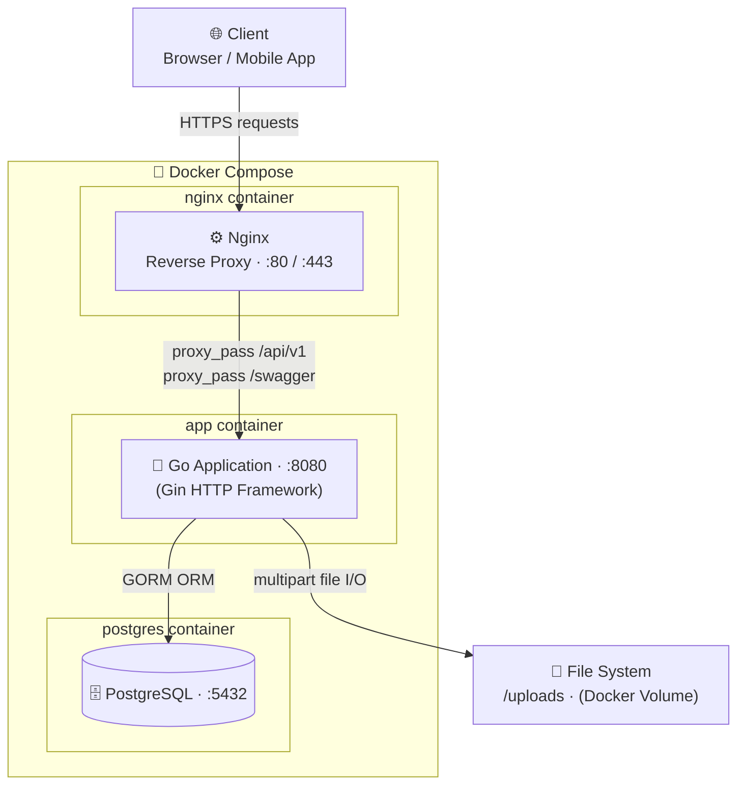
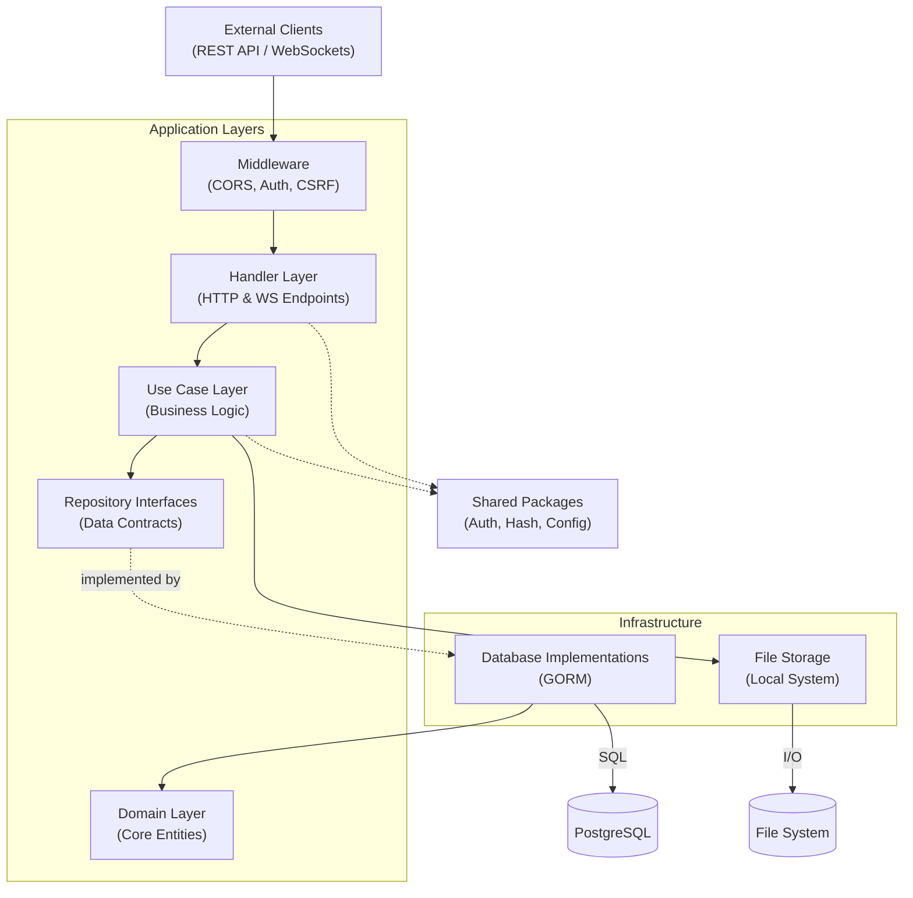

# SocialConnect Backend — Architecture

## Request Flow

```mermaid
graph TB
    Client["🌐 Client\nBrowser / Mobile App"]

    subgraph Docker["🐳 Docker Compose"]
        direction TB

        subgraph nginx_c["nginx container"]
            Nginx["⚙️ Nginx\nReverse Proxy · :80 / :443"]
        end

        subgraph app_c["app container"]
            App["🔷 Go Application · :8080\n(Gin HTTP Framework)"]
        end

        subgraph pg_c["postgres container"]
            DB[("🗄️ PostgreSQL · :5432")]
        end
    end

    FS["📁 File System\n/uploads · (Docker Volume)"]

    Client -->|"HTTPS requests"| Nginx
    Nginx -->|"proxy_pass /api/v1\nproxy_pass /swagger"| App
    App -->|"GORM ORM"| DB
    App -->|"multipart file I/O"| FS
```

## Architectural Overview

```mermaid
flowchart TB
    Clients["External Clients\n(REST API / WebSockets)"]

    subgraph App["Application Layers"]
        direction TB
        MW["Middleware\n(CORS, Auth, CSRF)"]
        H["Handler Layer\n(HTTP & WS Endpoints)"]
        UC["Use Case Layer\n(Business Logic)"]
        RI["Repository Interfaces\n(Data Contracts)"]
        Domain["Domain Layer\n(Core Entities)"]
    end

    subgraph Infra["Infrastructure"]
        direction TB
        GORMImpl["Database Implementations\n(GORM)"]
        StorageImpl["File Storage\n(Local System)"]
    end

    PKG["Shared Packages\n(Auth, Hash, Config)"]

    DB[("PostgreSQL")]
    FS[("File System")]

    Clients --> MW
    MW --> H
    H --> UC
    H -.-> PKG
    UC --> RI
    UC -.-> PKG
    UC --> StorageImpl
    RI -.->|"implemented by"| GORMImpl
    GORMImpl --> Domain
    GORMImpl -->|"SQL"| DB
    StorageImpl -->|"I/O"| FS
```
